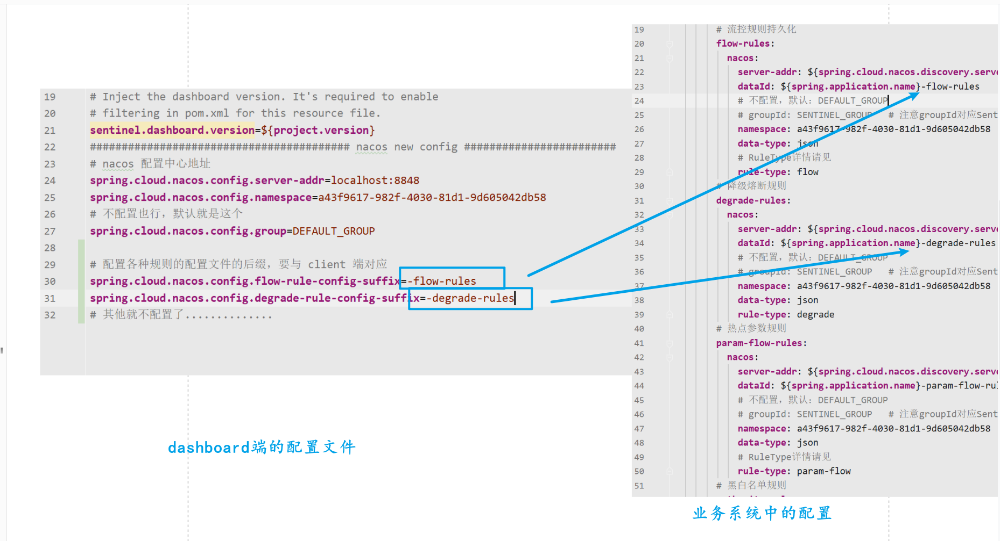

# sentinel 控制台 推送到nacos版本。

## 0. 前言
> 如果使用这个的话，则需要 sentinel client端的各种rules 需要从 nacos  中进行拉取（这部分不用实现，sentinel 官方已经实现，当然你也可以自己实现）

> 使用此种方式有一种缺点：同种服务、不同机器的限流规则 不太容易进行细粒度的控制。  
> 比如user服务 部署在机器a一份，机器b一份。
> 此时由于两个user服务都监听 nacos 配置中心的 xxxx-rules 这么一个流控配置,
> 就会导致这个 xxxx-rules 的配置在 两个机器中都生效。
> 你无法精准控制 机器a中user服务的限流参数 和 机器b的user服务的限流参数，
> 因为他们监听的配置文件相同。


> 有需要用的，测试出bug，需要更改的话，
> 请大概阅读 一下 sentienl client端源码（大概架构即可）、 
> sentinel dashboard 的推送方式部分源码后， 即可自行更改 dashboard 的源码（或者联系本人一起讨论）

> 从本项目的提交日志即可看到我一步一步都改了什么；因为我是从原来sentinel nacos的源代码开始进行更改的。


## 1. 规则推送方式

> 图中的nacos是做配置中心用的。你可以将图中的nacos换成任何形式的配置中心。（只不过需要你自己去对接配置中心了。官方也给出了适配主流配置中心的demo，详情可以访问sentinel的github）


## 2. 使用方式

### 2.1 client 端的配置

#### 引入pom
```xml
<!-- sentinel -->
<dependency>
    <groupId>com.alibaba.cloud</groupId>
    <artifactId>spring-cloud-starter-alibaba-sentinel</artifactId>
</dependency>
<!-- 持久化 -->
<dependency>
    <groupId>com.alibaba.csp</groupId>
    <artifactId>sentinel-datasource-nacos</artifactId>
</dependency>

```

#### application配置


### 2.2 dashboard 端的配置

#### nacos配置中心的配置


#### 对应配置文件的后缀配置




> 这个是可以不配置的，不配置的有默认值。

默认值如下：

```java
/**
  * configuration file suffix for flow rules
  */
private String flowRuleConfigSuffix = "-flow-rules";

/**
  * configuration file suffix for degrade rules
  */
private String degradeRuleConfigSuffix = "-degrade-rules";

/**
  * configuration file suffix of param rules
  */
private String paramFlowRuleConfigSuffix = "-param-flow-rules";

/**
  * configuration file suffix of authority rules
  */
private String authorityRuleConfigSuffix = "-authority-rules";

/**
  * configuration file suffix of system rules
  */
private String systemRuleConfigSuffix = "-system-rules";
```


## 3. 其他持久化的方式

> 下面这种方案可以很细致的管理每个服务的规则。


> 随意搭配，你想怎么弄就怎么弄。下面是另一种方案（本文nacos方案就属于这种）
>
> 使用数据库、redis、zk...的话，比较容易做到每个实例规则精准烤制。


## 4. 效果


## 5. 注意

当更改了配置之后，需要刷新一下才能看到最新值。


## 最后，如何避免懒加载？

在使用 sentinel dashboard 的时候，每次都需要访问一次业务系统的接口之后，才能在 dashboard 中查到这个实例的相关信息，这是为什么呢？怎么解决这个问题呢？


### 是什么原因？

一猜就知道：只有在第一次访问接口的时候，sentinel 才会初始化；也就是说，sentinel 初始化时 client端与dashboard 的心跳机制才被初始化，dashboard 的才能收到 业务系统的信息。

我们翻看源码便知，的确是这样：


我们都知道，jvm的类加载都是懒加载，即：第一次被使用的时候才会加载。

从上图可知，只有在第一次请求时，这个类才被用到，所以此类才会被加载。


类加载之后，会调用 静态代码块，如下：


心跳机制才被初始化：


### 怎么解决呢？

很简单，在系统启动的时候，使用一下这个类，然后static代码块被执行。

然后sentinel就被初始化、心跳机制被初始化。

然后问题解决。


举例如下:

```java

public class SentinelUserApplication {

    public static void main(String[] args) {
        SpringApplication.run(SentinelUserApplication.class, args);
        // 初始化Setinel的Env.sph,
        // 然后初始化所有的东西，
        // 不然这个是会在 第一次访问的时候初始化
        // 初始化使用的是spi
        // 所以 与dashboard的 心跳什么的 也是一个
        // InitFunc
        // 所以我们可以在这里进行初始化
        log.info(Env.sph.toString());
    }
}

```


